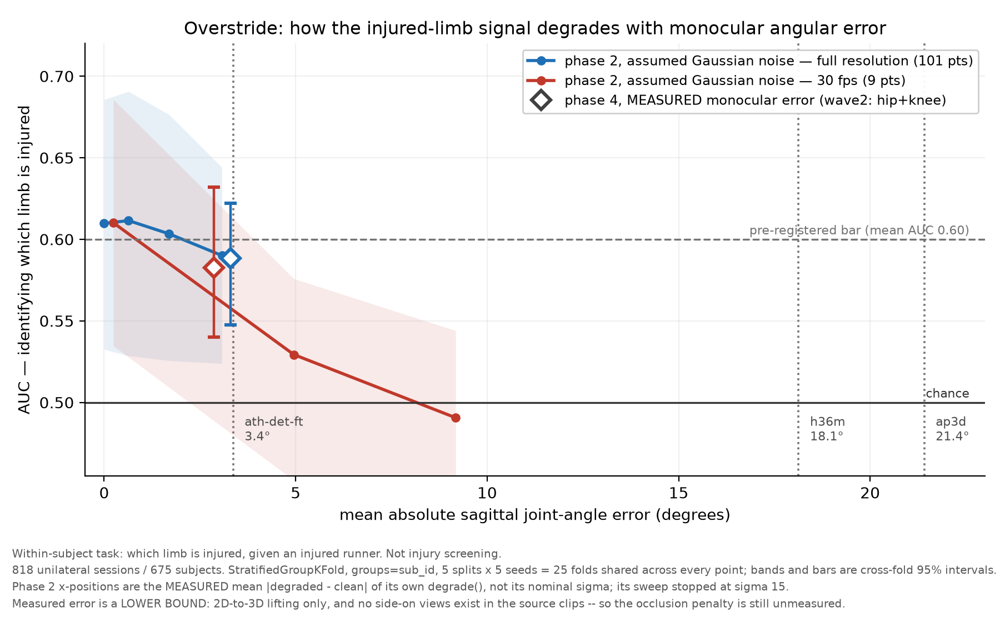
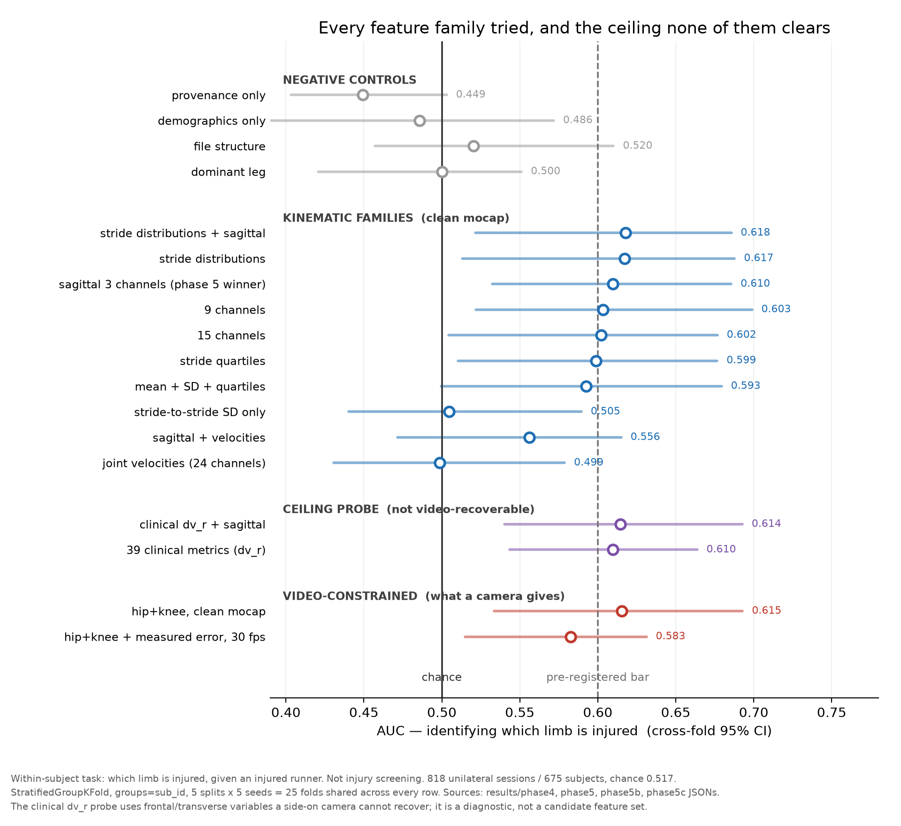
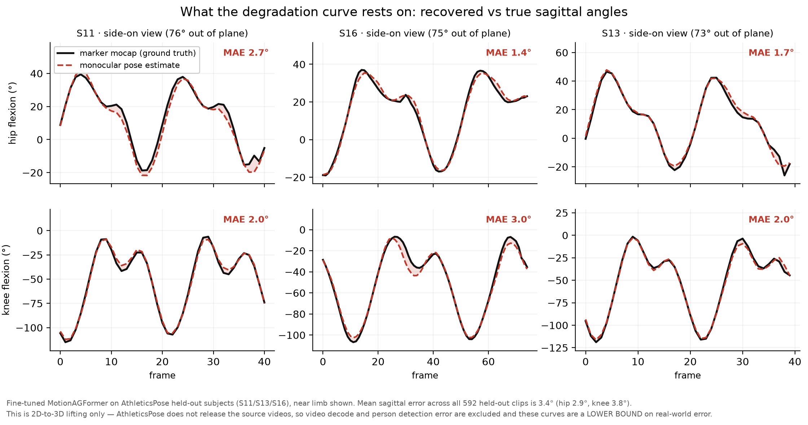
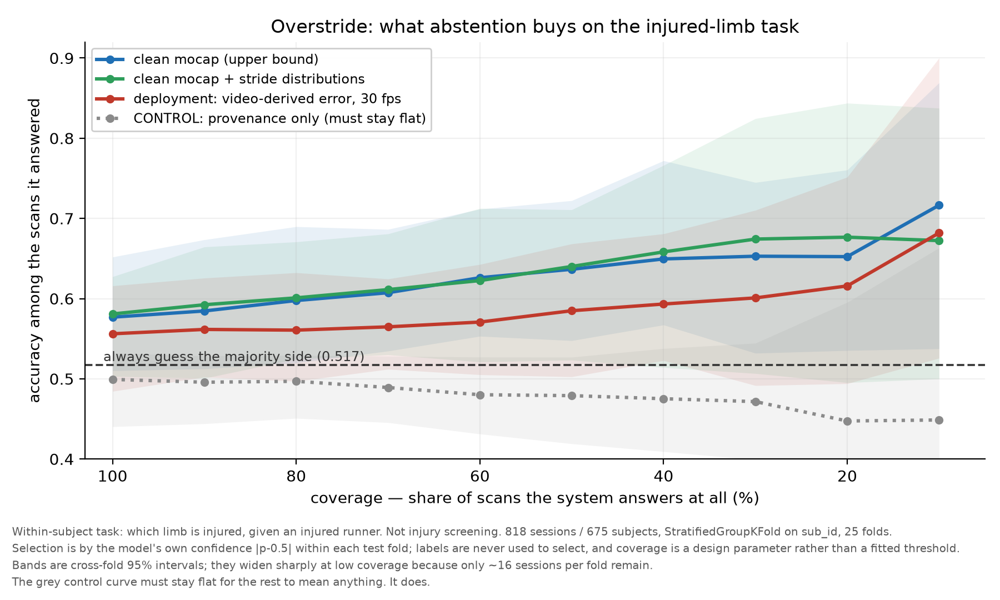

# Overstride

**Injury-risk screening for runners from monocular video — a measurement, and a
negative result.**

The project asked one question: *how much injury-classification performance is
lost when lower-limb kinematics are recovered from a single camera instead of a
motion capture lab?*

**The answer is about 0.03 AUC. The reason it is so small is that there was very
little to lose.**

---

## The finding

Going from marker-based motion capture to monocular video costs **0.027–0.033
AUC** on the only task in this dataset that carries any kinematic injury signal
at all. But that task — identifying *which limb* is injured in a runner already
known to be injured — tops out at **AUC 0.610** on perfect mocap, and lands at
**0.583** once real measured video error is injected. Chance is 0.517.

**The camera is not the bottleneck. The physiology is.** Six phases of
diagnostics say the ceiling is a property of what unilateral running injury does
to stance-phase gait symmetry in this cohort, not of how it has been modelled.



## Two levels, two verdicts

**Screening — does this runner have an injury? Failed outright.**
Zero of 60 pre-registered tests survived Benjamini–Hochberg correction. No
kinematic feature set beat a decontaminated demographics control in any of five
injury conditions. Worse, a **provenance-only** model — questionnaire
missingness and collection year, no physiology whatsoever — scores **0.775
pooled and 0.863 on patellofemoral pain**, because questionnaire completeness
tracks the study wave and the waves differ in injury mix. Most of what looks like
a gait signal in this dataset is paperwork.

**Within-subject limb identification — which side is injured? Real, but small.**
Comparing a runner's injured limb to their own healthy limb in the same trial
eliminates the confound by construction: demographics, provenance, file structure
and limb dominance are all constant within a session, and all four were verified
at chance (max |AUC − 0.5| = 0.051). That task clears its pre-registered bar at
**0.610 [0.532, 0.686]** — and then fails every deployment requirement.

## Why the ceiling is the signal, not the model



Five independent lines of evidence, each designed to detect headroom:

| test | result |
|---|---|
| **Different measurement modality** — 39 clinical frontal/transverse metrics (pronation, hip adduction, pelvic drop, step width) | **0.610**, identical to the sagittal waveform model. ΔAUC +0.000 [−0.067, +0.071] |
| **Severity dose-response** (pre-registered, direction declared before fitting) | ρ = **+0.044** [−0.038, +0.130], p = 0.228. Flat, and anti-monotone by stratum |
| **Learning curve** | 0.585 → 0.599 → 0.608 → 0.610. The last quarter of the data bought **+0.001** |
| **Four more feature families** — velocities, stride distributions, per-condition splits | Best is +0.008 with a CI spanning [−0.110, +0.089]. Velocities score **0.499** |
| **Abstention and repeat scans** | Neither rescues the deployment configuration |

If the ceiling were an artefact of the sagittal waveform representation, a
clinical scalar set built from different planes and different physics would not
reproduce it to three decimals.

## What the video pipeline actually costs

Sport-fine-tuned monocular pose recovers sagittal joint angles to **3.4° mean
absolute error** (MPJPE 51.7 mm), against a published band of 14.1–25.8° for
generic models on clinical gait — the generic checkpoint here reproduces that
band at 18.1°, which is what validates the setup.



Two findings make the camera path *better* than expected:

- **The far-limb occlusion penalty is ~0** and does not grow with viewing angle
  (+0.07° extrapolated to a fully lateral view).
- **Accuracy improves as the view becomes side-on** (4.66° → 2.11° across
  view-angle quartiles) — and side-on is exactly the geometry this application
  prescribes.

## Why no demo was built

A per-user readout would misrepresent the evidence. At the realistic operating
point (hip+knee, side-on camera error, 30 fps, pooled out-of-fold AUC 0.569):

| | value |
|---|---|
| best PPV | **0.574** against a 0.517 base rate |
| sensitivity at 90% specificity | **0.130** |
| calibration slope | **0.716** (1.0 is perfect) |
| Brier improvement over a constant | **1.5%** |
| **agreement on repeat scans of the same runner** | **0.667** |

**The model changes its mind about the same runner on a third of repeat scans** —
0.744 even on perfect mocap. And averaging a runner's repeat sessions does *not*
help (0.587 → 0.583), which means the error is **subject-specific rather than
random**: the model is consistently wrong about the same people. That closes the
"just scan them twice" escape route.

Selective classification — answering only the most confident scans — does work
on mocap (**0.637 [0.548, 0.722]** at 50% coverage, validated against a control
curve that stays flat). On video-derived data no coverage level reliably beats
guessing.



## Phases and gates

| # | work | gate | outcome |
|---|---|---|---|
| 0 | Inventory, join, verify against Table 1 | inventory exists, Table 1 reproduces | ✅ |
| 1 | Injury classifier vs demographics control | beat the control | ❌ **kill criterion fired** — 0/60 tests |
| 2 | Degrade to video constraints | degradation measured | ✅ interaction found; σ labels later corrected |
| 3 | Video → 3D kinematics | MAE within published range | ✅ 3.4° fine-tuned, 18.1° generic |
| 3B | Viewpoint geometry | — | ✅ overturned a unit error; occlusion penalty ~0 |
| 4 | Measured error through the phase-2 model | real ΔAUC | ✅ −0.027 to −0.033 |
| 4B | Operating point, calibration, repeatability | — | ❌ not deployable |
| 5 | Within-subject limb identification | beat the population model | ✅ 0.610, all confounds at chance |
| 5B/5C/5D | Ceiling diagnostics, feature attempts, abstention | — | ❌ ceiling is the signal |
| 6 | Methods demo + synthesis | — | this document |
| 7 | Harden the inference path; video → kinematics tool | — | ✅ −0.25° recovered; 3.4° confirmed at 3.43° |

**Phase 1's kill criterion fired and the project continued deliberately**, onto
the within-subject task, which met an equivalent pre-registered bar against a
stronger control set. That pivot is recorded in `results/phase02.md`.

Resuming this work? Start with
[`docs/AGENT_CONTEXT.md`](docs/AGENT_CONTEXT.md) — current state, the traps that
already cost real errors, and an honest register of what is still missing.

Full reports: [`results/`](results/) — one `phaseNN.md` per phase, each with
cross-fold CIs, the exact split, n per group, and what was excluded and why.
A single-page synthesis with all four figures is at
[`docs/overstride.html`](docs/overstride.html), built by
`scripts/phase6_page.py`.

## Reproduction

```bash
uv sync
cp .env.example .env          # set DATA_ROOT to the Ferber archive

.venv/Scripts/python.exe scripts/phase0_inventory.py
.venv/Scripts/python.exe scripts/phase5_limb.py           # the limb task
.venv/Scripts/python.exe scripts/phase3_infer.py          # ~90 min CPU
.venv/Scripts/python.exe scripts/phase4_real_delta.py     # the degradation curve
.venv/Scripts/python.exe scripts/phase6_numbers.py        # every number above, from source
```

### Running it on your own video

```bash
.venv/Scripts/python.exe scripts/video_kinematics.py --video CLIP.mp4 --out DIR
.venv/Scripts/python.exe -m pytest tests/ -q
```

Side-on clip of a single runner in, hip and knee flexion traces out. **It is a
kinematics extractor and says nothing about injury** — phases 4B and 5D
established a per-runner verdict is unsupportable. It prints its full error
budget on every run and refuses to write output when it cannot find the subject.
See `results/phase07.md`.

Waveforms are **derived, not stored** — the archive holds raw marker
trajectories and scalar summaries only, and the 101-point stance curves come from
the bundled MATLAB pipeline. See `CLAUDE.md` for the full conventions.

## What a reader should not conclude

- **Not that running gait carries no injury information.** This is one cohort,
  one protocol, treadmill running, stance phase only, with a provenance confound
  that had to be removed by construction.
- **Not that monocular pose estimation is inadequate.** It is not the limiting
  factor here — it costs ~0.03 AUC, and its errors are a *lower bound* (2D→3D
  lifting only; the source videos are not released, so decode and detection error
  are excluded).
- **Not that a different model would fix it.** That is the specific claim phases
  5B–5D were built to test, and it does not hold.
- **Nothing here forecasts future injury.** Every label describes injury status
  at the time of testing. This is detection and classification only.

## Data and licensing

- **Ferber / Running Injury Clinic Kinematic Dataset** (n=1,798) — never
  committed; lives at `$DATA_ROOT`, covered by `.gitignore`.
- **AthleticsPose** (CC BY-NC-SA 4.0) and **AthletePose3D** (non-commercial
  research only) — used for the monocular error measurement. **Commercial use is
  prohibited**, and no commercial framing of this work is permitted.
